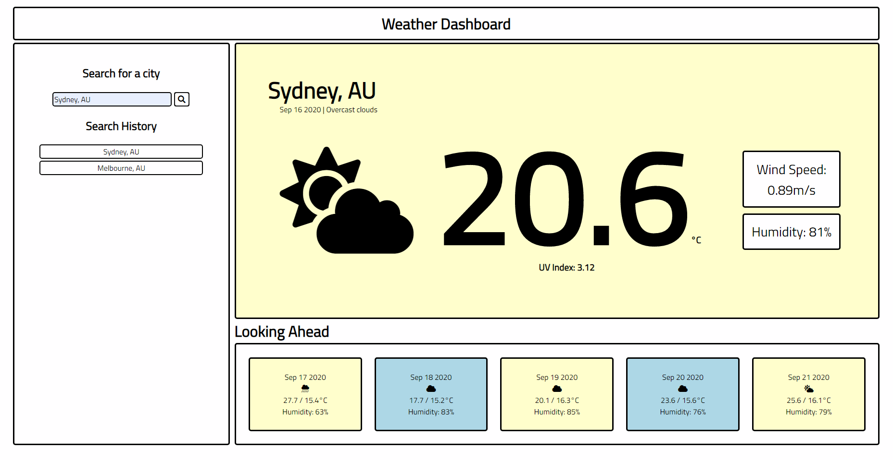

# Weather-Dashboard

Deployed Application: https://smcheah.github.io/Weather-Dashboard/

Use of server-side API: https://www.weatherbit.io/api

A weather dashboard that uses a third party API to pull in data to be displayed. 

Features:
- responsive layout
- colour coded UV index
- search for any city's weather
- saves history in local storage
- current weather and 5-day forecast
